# 闲商城

优达学城商城类小程序项目。本项目后端需要搭建腾讯云服务，构建数据库，实现api以及图片存储，小程序前端需要通过后端返回的接口实现一个商城的正常运行话功能，比如商品商品列表、订单列表、购物车，同时还可以练习微信账号授权登录，是一个比较综合的项目，需要具备一定的 **JavaScript、CSS以及SQL** 知识。

当前分支是基于腾讯云服务进行后端开发的，[master分支](https://github.com/fujianlian/mall)是基于**小程序云开发**进行后端开发的，相对来说比较简单，建议选择这种模式开发

## 小程序截图 
 
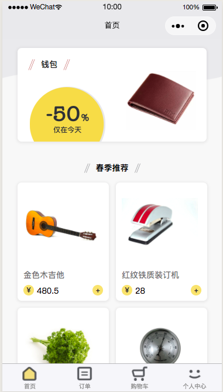 | 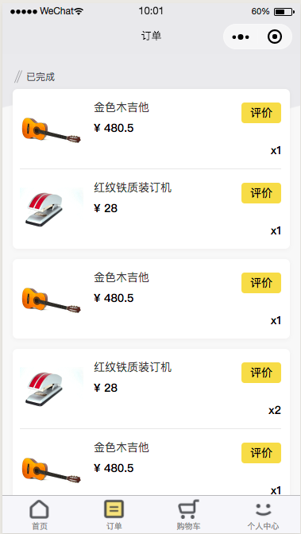 |  |  | 
| :--: | :--: | :--: | :--: | 
| 首页 | 订单 | 购物车 | 个人中心 | 
 
 |  | 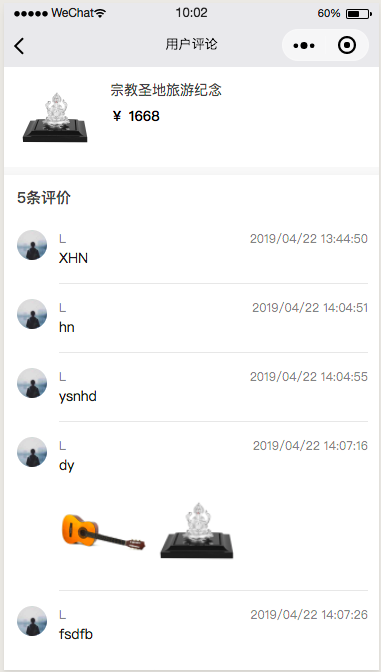 | 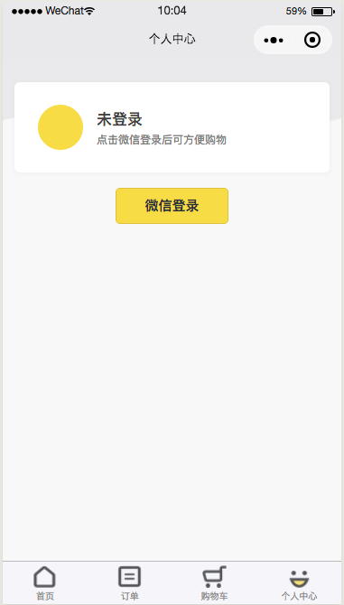 | 
| :--: | :--: | :--: | :--: | 
| 商品详情 | 添加评论 | 用户评论 | 未登录 |

## 运行前准备

1. 注册[小程序开发帐号](https://mp.weixin.qq.com/cgi-bin/registermidpage?action=index)，完成注册之后，登录[微信公众平台官网](https://mp.weixin.qq.com/) ，点击 **“设置 -> 开发设置”**，获取你的 **AppID 帐号**，后面初始化项目需要用到。

2. 注册[腾讯云账号](https://cloud.tencent.com/register)，注册成功之后，访问[https://console.qcloud.com/lav2/dev](https://console.qcloud.com/lav2/dev) ，然后按照步骤绑定小程序账号

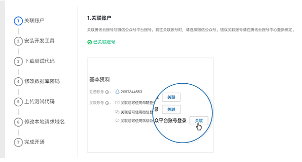

## 运行项目

1. 安装[微信开发者工具](https://developers.weixin.qq.com/miniprogram/dev/devtools/download.html)

2. 下载源码，打开微信开发者，选择小程序导入源码，**AppID改为自己申请的**

3. 编辑器中打开 `server/config.js` 文件，将自己的AppID填入 `appId` 和 `mysql/pass`，自己的appSecret填入 `appSecret` 中并保存

## 腾讯云配置

这时候运行项目会发现网络请求错误，因为到目前为止还没有配置腾讯云，具体配置步骤如下：

### 一、通过微信公众平台授权登录腾讯云

打开[微信公众平台](https://mp.weixin.qq.com)注册并登录小程序，按如下步骤操作：

1. 单击左侧菜单栏中的【设置】。
2. 单击右侧 Tab 栏中的【开发者工具】。
3. 单击【腾讯云】，进入腾讯云工具页面，单击【开通】。
4. 使用小程序绑定的微信扫码即可将小程序授权给腾讯云，开通之后会自动进去腾讯云微信小程序控制台，显示开发环境已开通，此时可以进行后续操作。

> **注意：**
>
> 此时通过小程序开发者工具查看腾讯云状态并不会显示已开通，已开通状态会在第一次部署开发环境之后才会同步到微信开发者工具上。
> 以下示例图片为旧版公众平台页面，新版页面开发者工具现已移到左边 **开发** 选项中

### 二、上传

1. 点击界面右上角的【腾讯云】图标，在下拉的菜单栏中选择【上传测试代码】(如果没有腾讯云图标，右击右上角空白区域，选择自定义工具管理)。

   

2. 选择【模块上传】并勾选全部选项，然后勾选【部署后自动安装依赖】，点击【确定】开始上传代码。

   

   
   
3. 上传代码完成之后，点击右上角的【详情】按钮，接着选择【腾讯云状态】即可看到腾讯云自动分配给你的开发环境域名：

   

4. 完整复制（包括 `https://`）开发环境 request 域名，然后在编辑器中打开 `client/config.js` 文件，将复制的域名填入 `host` 中并保存，保存之后编辑器会自动编译小程序

## 配置对象存储（图片存储服务器）

1. 点击界面右上角的【腾讯云】图标，在下拉的菜单栏中选择【前往管理中心】，进入网站，点击 **左上角 云产品 存储 对象存储**，进入以下页面，然后按照步骤 **创建存储桶**

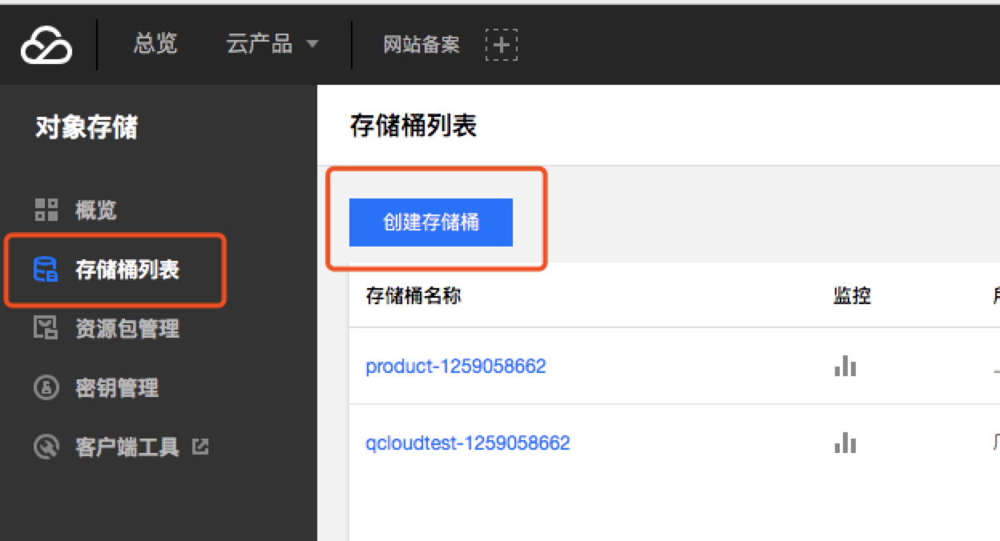

2. 创建存储桶完成后将 `images&sql/products` 下的图片全部全部上传，如下图类似

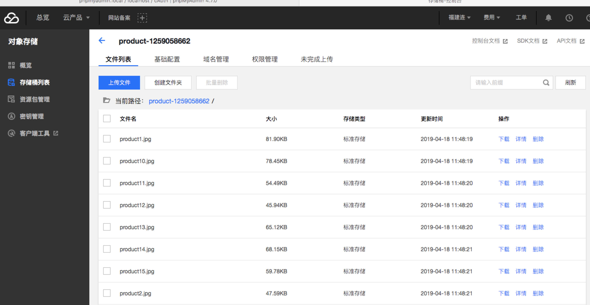

3. 点击任意一张图片，复制图片地址前缀（类似https://*****.ap-shanghai.myqcloud.com/），打开 `images&sql` 下的 **demo.sql** 文件，将 **IMAGE_BASE_URL** 的值修改为复制的地址前缀

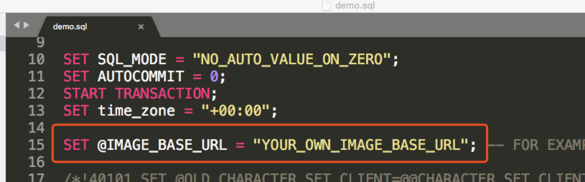

4. 上传图片需要权限验证，**左上角 云产品 监控与运维 访问密匙**，然后新建密匙，替换 `client/config.js` 的相关数据，如下图

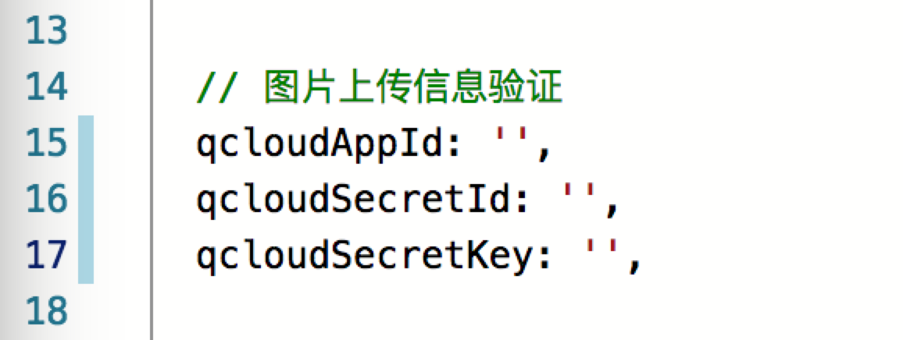

## 数据库导入

1. 在腾讯云管理中心开发环境选项下点击phpMyAdmin，登录账号为我们在 `server/config.js` ——> `mysql` 中的 **user** 和 **pass** 变量值，本项目变量值分别为root和appSecret

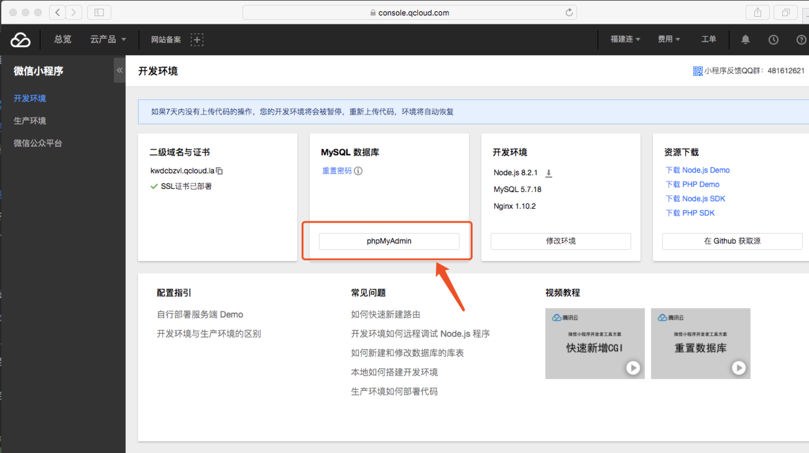

2. 进入phpMyAdmin管理页面，选择 **cAuth** 数据库，点击导入，导入sql文件为 `images&sql` 下的 **demo.sql** ，按照步骤进行导入

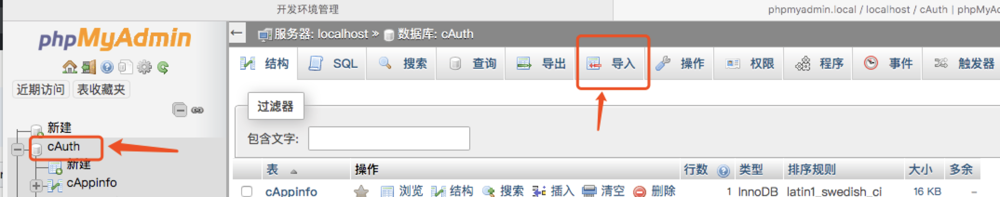

3. 此时就可以正常运行项目了

## 贡献

* 如果你在使用过程中遇到问题，欢迎给我提Issue

* 如果你有好的想法，欢迎pull request

* 觉得不错的话，顺手 **点个Star**，笔者需要您的支持

